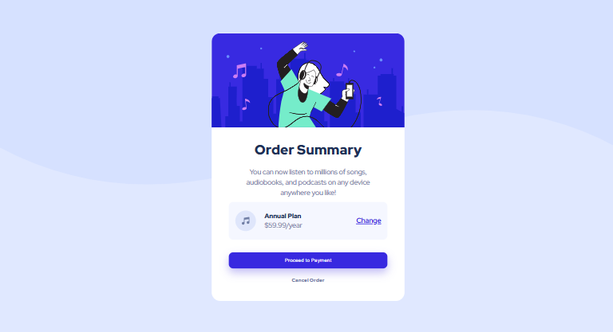

# Frontend Mentor - Order Summary Card

This is my solution to the [Order Summary Card challenge](https://www.frontendmentor.io/challenges/order-summary-component-QlPmajDUm) on Frontend Mentor.

## Screenshot

## Links

- Live Site: [[YOUR_LIVE_SITE_URL](https://order-summary-umber-pi.vercel.app/)]
- Solution: [https://github.com/Neharajendran-04/order-summary]

## Built With

- HTML5
- CSS3
- Flexbox
- Responsive Design

## What I Learned

While building this project, I practiced:

- Creating layouts with Flexbox
- Using CSS custom properties (variables)
- Making responsive layouts with media queries
- Creating hover states and smooth transitions
- Using `box-shadow` to improve the visual depth of elements
- Building a layout that adapts to different screen sizes

## Author

- Frontend Mentor: [YOUR_FRONTEND_MENTOR_PROFILE_URL](https://www.frontendmentor.io/profile/Neharajendran-04)